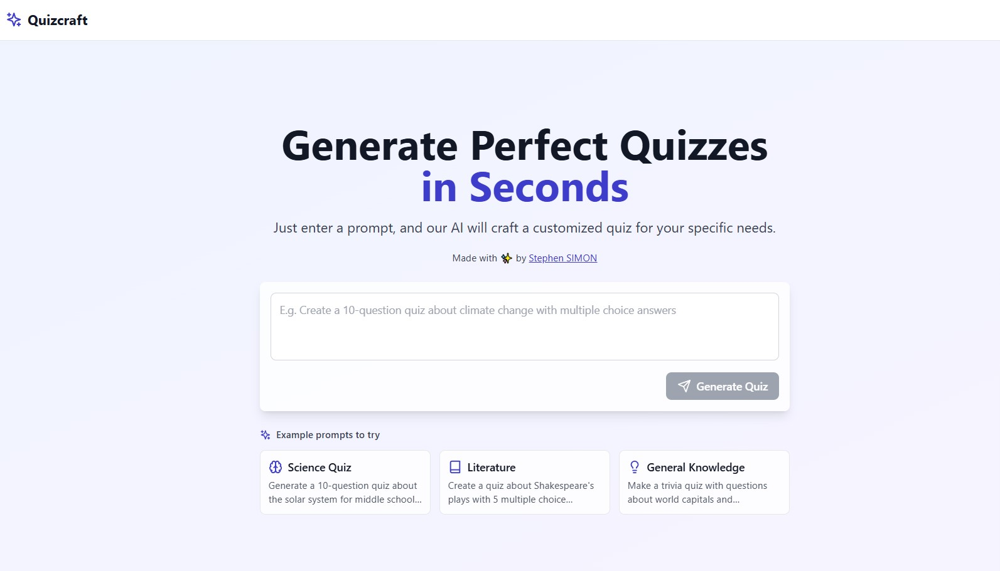

# 🧠 AI Quiz Craft

Create engaging quizzes in seconds using the power of AI!  

**AI Quiz Craft** leverages Google's **Gemini API** to automatically generate customized quiz questions on any topic, delivering a seamless and intelligent quiz-building experience.

 <!-- Replace with your actual screenshot path -->


## 🚀 Features

- 🔮 **AI-Powered Quiz Generation**  
  Instantly generate quiz questions using Google's Gemini API.
  
- 🧩 **Supports Multiple Formats**  
  Choose between **Multiple Choice** and **True/False** questions.
  
- 💻 **Modern, Responsive UI**  
  Sleek and mobile-friendly interface built for a great user experience.
  
- 🛡️ **TypeScript-First Codebase**  
  Designed for reliability, scalability, and maintainability.


## ⚙️ How It Works

1. **Enter a Prompt**  
   Provide a topic or subject for your quiz.
   
2. **Generate Questions**  
   The Gemini API processes the prompt and returns unique, relevant quiz questions and answers.
   
3. **Take the Quiz**  
   Answer the questions and view your score instantly.


## 🛠️ Tech Stack

- [Vite](https://vitejs.dev/) + [React](https://react.dev/)
- TypeScript
- HTML & CSS
- [Gemini API](https://ai.google.dev/) for quiz content generation


## 📦 Installation

```bash
git clone https://github.com/codewithsimon/ai-quiz-craft.git
cd ai-quiz-craft
npm install
npm run dev
```


## 🗝️ Gemini API Setup

To use the AI quiz generation feature, you’ll need a Gemini API key:

1. [Get your Gemini API key](https://ai.google.dev/)
2. Add your API key to your environment variables or configuration file (see `.env.example` if available):

```env
GEMINI_API_KEY=your_gemini_api_key_here
```


## 💡 Usage

1. Type a topic or question prompt.
2. Click **"Generate Quiz"**.
3. Gemini will return a set of quiz questions.
4. Answer the questions and get your score instantly!


## 🤝 Contributing

Contributions are welcome!  
Please open an issue or pull request to discuss any changes.


## 📄 License

This project is licensed under the [MIT License](LICENSE).


## 🙋‍♂️ Questions?

Open an [issue](https://github.com/codewithsimon/ai-quiz-craft/issues) or reach out to [codewithsimon](https://github.com/codewithsimon).


Let me know if you want to add demo links, screenshots, or more instructions!
